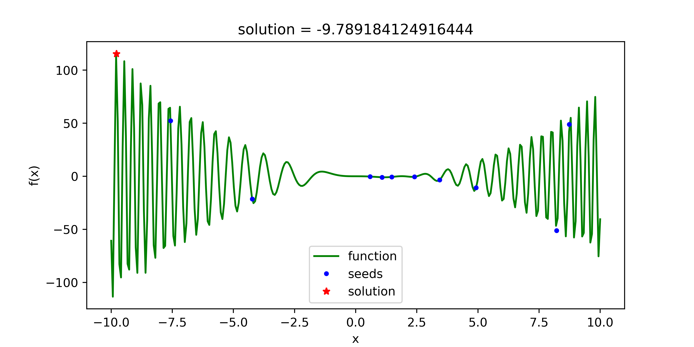

# 粒子群算法

## 算法背景

粒子群优化（Particle Swarm Optimization, PSO），又称微粒群算法，是由J. Kennedy和R. C. Eberhart等于1995年开发的一种演化计算技术，来源于对一个简化社会模型的模拟。其中“群（swarm）”来源于微粒群匹配M. M. Millonas在开发应用于人工生命（artificial life）的模型时所提出的群体智能的5个基本原则。“粒子（particle）”是一个折衷的选择，因为既需要将群体中的成员描述为没有质量、没有体积的，同时也需要描述它的速度和加速状态。

PSO算法最初是为了图形化的模拟鸟群优美而不可预测的运动。而通过对动物社会行为的观察，发现在群体中对信息的社会共享提供一个演化的优势，并以此作为开发算法的基础。从随机解出发，通过迭代寻找最优解，通过适应度来评价解的品质。通过加入近邻的速度匹配、并考虑了多维搜索和根据距离的加速，形成了PSO的最初版本。之后引入了惯性权重来更好的控制开发（exploitation）和探索（exploration），形成了标准版本。为了提高粒群算法的性能和实用性，中山大学、（英国）格拉斯哥大学等又开发了自适应（Adaptive PSO）版本和离散（discrete）版本。

## 算法思想

设想这样一个场景：一群鸟在随机搜索食物。在这个区域里只有一块食物。所有的鸟都不知道食物在那里。但是他们知道当前的位置离食物还有多远（通过食物的气味）。那么找到食物的最优策略是什么呢。最简单有效的就是搜寻目前离食物最近的鸟的周围区域。我们假设群体中每只鸟的飞行行为均且仅受到三方面因素的影响和贡献：

* 每只鸟自身的飞行惯性 --- 自身惯性贡献；

* 每只鸟的历史最优状态 --- 自身认知贡献；

* 整个鸟群的历史最优状态 --- 群体经验贡献。

注意，此处以与食物的距离（即香味浓度，也就是状态函数值）来判断飞行状态的优劣。根据此三类贡献，状态空间内每只鸟将逐渐调整自身的飞行速度（包括大小、方向），并向食物位置（即局部香味最浓的位置）汇聚。因此，在相关参数设置合理的前提下，粒子群算法的最终解应该对应于给定状态空间内的最值。

## 算法流程

标准PSO算法流程如下：

1. 初始化一群微粒（群体规模为$m$），包括随机的位置$x$和速度$v$；
2. 评价每个微粒的适应度$fitness$；
3. 对每个微粒，将它的适应值和它经历过的最好位置$pbest$的作比较，如果较好，则将其作为当前的最好位置$pbest$；
4. 对每个微粒，将它的适应度$fitness$和全局所经历最好位置$gbest$的作比较，如果较好，则重新设置$gbest$的索引号；
5. 更新微粒的位置$x$和速度$v$；
6. 如未达到结束条件（通常为足够好的适应值或达到一个预设最大代数$iterMax$），回到2）。

##  迭代公式

**粒子群速度更新公式**：

$V_𝑖(𝑡+1)=𝜔V_𝑖(𝑡)+𝑐_1𝑟_1(𝑝𝑏𝑒𝑠𝑡_𝑖−X_𝑖(𝑡))+𝑐_2𝑟_2(𝑔𝑏𝑒𝑠𝑡−X_𝑖(𝑡))$
式中右面三项分别代表：自身惯性贡献、自身认知贡献和群体经验贡献。

$w$：惯性因子

$c_1$、$c_2$：学习因子

$r_1$、$r_2$：[0,1]之间的均匀随机数

$pbest_i$：第$i$个粒子目前的历史最优状态

$gbest$：整个粒子群目前的历史最优状态

$V_i(t)$：$t$时刻粒子$i$的速度

$X_i(t)$：$t$时刻粒子$i$的位置

实际问题可能处于多维空间内，因此有：

$V_i=(v_{i1},v_{i2},...,v_{iD})$ 

$X_i=(x_{i1},x_{i2},...,x_{iD})$

$D$：空间维数

**粒子群位置更新公式**：

$X_i(t+1)=X_i(t)+V_i(t+1)$

## 代码实现

```python
import numpy as np
import matplotlib.pyplot as plt
import random

class Particle(object):
    def __init__(self, v, x):
        self.v = v                    # 粒子当前速度
        self.x = x                    # 粒子当前位置
        self.pbest = x                # 粒子历史最优位置
        
class PSO(object):
    def __init__(self, interval, tab='min', Num=10, iterMax=1000, w=1, c1=1, c2=1):
        self.interval = interval                              # 给定求解空间
        self.tab = tab.strip()                                # 求解最大值还是最小值的标签: 'min' - 最小值；'max' - 最大值
        self.iterMax = iterMax                                # 迭代求解次数
        self.w = w                                            # 惯性因子
        self.c1, self.c2 = c1, c2                             # 学习因子
        self.v_max = (interval[1] - interval[0]) * 0.1        # 设置最大速度
        #######################################################
        self.particle_list, self.gbest = self.initPartis(Num) # 完成粒子群的初始化，并提取群体历史最优位置
        self.x_seeds = np.array(list(particle.x for particle in self.particle_list))     # 提取粒子群的种子状态
        self.solve()                                          # 完成主体求解过程
        self.display()                                        # 数据可视化展示
        
    def initPartis(self, Num):
        particle_list = list()
        for i in range(Num):
            v_seed = random.uniform(-self.v_max, self.v_max)
            x_seed = random.uniform(*self.interval)
            particle_list.append(Particle(v_seed, x_seed))
        temp = 'find_' + self.tab
        if hasattr(self, temp):                               # 采用反射方法提取对应的函数
            gbest = getattr(self, temp)(particle_list)
        else:
            exit('>>>tab标签传参有误："min"|"max"<<<')
        return particle_list, gbest
        
    def solve(self):
        for i in range(self.iterMax):
            for particle in self.particle_list:
                f1 = self.func(particle.x)
                # 更新粒子速度，并限制在最大速度之内
                particle.v = self.w * particle.v + self.c1 * random.random() * (particle.pbest - particle.x) + self.c2 * random.random() * (self.gbest - particle.x)
                if particle.v > self.v_max:
                    particle.v = self.v_max
                elif particle.v < -self.v_max:
                    particle.v = -self.v_max
                # 更新粒子位置，并限制在待解区间之内
                if self.interval[0] <= particle.x + particle.v <=self.interval[1]:
                    particle.x = particle.x + particle.v 
                else:
                    particle.x = particle.x - particle.v          # 不让粒子超出限制空间之外有很多方法
                f2 = self.func(particle.x)
                getattr(self, 'deal_'+self.tab)(f1, f2, particle) # 更新粒子历史最优位置与群体历史最优位置      
        
    def func(self, x):                                            # 适应度函数
        value = np.sin(x**2) * (x**2 - 2*x)
        return value
        
    def find_min(self, particle_list):              # 按适应度函数最小值找到粒子群初始化的历史最优位置
        p = min(particle_list, key=lambda p: self.func(p.pbest))
        return p.pbest
        
    def find_max(self, particle_list):              # 按适应度函数最大值找到粒子群初始化的历史最优位置
        p = max(particle_list, key=lambda p: self.func(p.pbest))
        return p.pbest
        
    def deal_min(self, f1, f2, particle):
        if f2 < f1:                                 # 更新粒子历史最优位置
            particle.pbest = particle.x
        if f2 < self.func(self.gbest):
            self.gbest = particle.x                 # 更新群体历史最优位置
            
    def deal_max(self, f1, f2, particle):
        if f2 > f1:                                 # 更新粒子历史最优位置
            particle.pbest = particle.x
        if f2 > self.func(self.gbest):
            self.gbest = particle.x                 # 更新群体历史最优位置
            
    def display(self):
        print('solution: {}'.format(self.gbest))
        plt.figure(figsize=(8, 4))
        x = np.linspace(self.interval[0], self.interval[1], 300)
        y = self.func(x)
        plt.plot(x, y, 'g-', label='function')
        plt.plot(self.x_seeds, self.func(self.x_seeds), 'b.', label='seeds')
        plt.plot(self.gbest, self.func(self.gbest), 'r*', label='solution')
        plt.xlabel('x')
        plt.ylabel('f(x)')
        plt.title('solution = {}'.format(self.gbest))
        plt.legend()
        plt.savefig('PSO.png', dpi=500)
        plt.show()
        plt.close()

if __name__ == '__main__':
    PSO([-10, 10], 'max')
```

## 代码分析

运行环境：Python3

适应度函数举例：$f(x)=sin(x^2)×(x^2 - 2x)$

最优化目标：找到在适应度函数$f(x)$在求解范围$[low\_bound, up\_bound]$内最大（max）或最小（min）时$x$的值

以运行

```python
PSO([-10, 10], 'max')
```

为例

得到结果：$x=-9.789184124916444$



蓝色点为初始化时的粒子位置，红色点为经过粒子群算法迭代求解后得到的最优值。